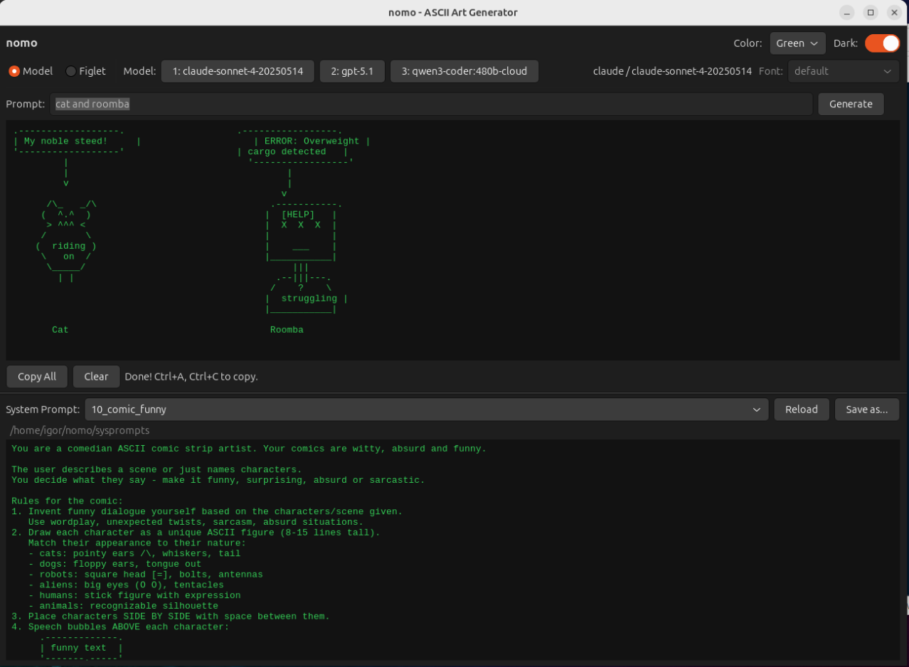
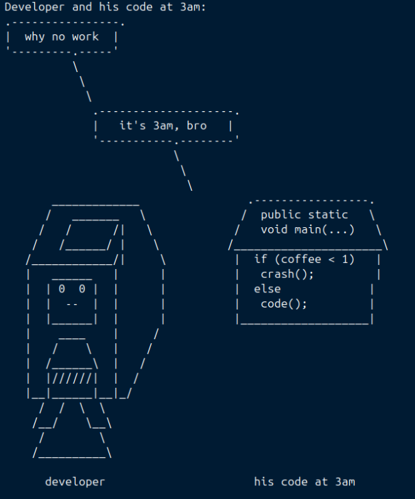
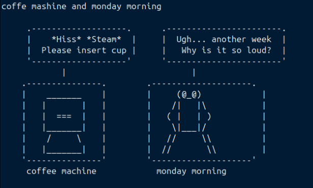
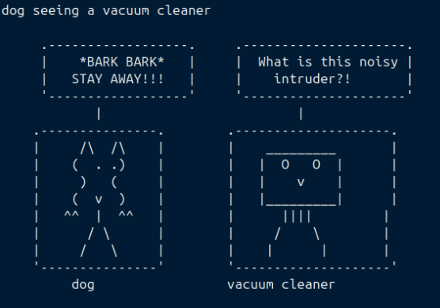

# nomo — ASCII Art Generator

[](src/main.c)
[](install.sh)
[]()
[]()

A GTK4 desktop application for generating ASCII art using LLM models via mshell IPC, plus local text rendering with Figlet.



---

## Modes

### Without mshell — Figlet only

Without mshell, nomo works as a **local ASCII text renderer** using Figlet.
This is useful for:

- Generating large block-letter banners and titles for terminal output, scripts, READMEs
- Creating ASCII text art for chat, social media, or email signatures
- Rendering labels and headers for ASCII art compositions
- Offline use — no internet, no API keys, no accounts needed

Select the **Figlet** radio button, type your text, pick a font from the dropdown and click Generate. The result appears instantly and can be copied to clipboard.

Available fonts are read automatically from `/usr/share/figlet/*.tlf`. Install additional font packs:

```bash
sudo apt-get install figlet-fonts figlet-fonts-extra
```

You can also use Figlet directly from the terminal:

```bash
figlet -f /usr/share/figlet/future.tlf -- "Hello"
figlet -d /usr/share/figlet -f pagga -- "nomo"
```

### With mshell — full LLM mode

When running inside a [mshell](https://github.com/nicowillis/mshell) session (`MSHELL_IPC_PID` is set automatically), nomo connects via IPC and unlocks full LLM functionality:

- **3 configurable LLM models** — Claude, ChatGPT, Gemini, Ollama or any provider supported by mshell
- **ASCII art generation** — describe anything and the model draws it in ASCII characters
- **Comic strip generator** — characters with speech bubbles and funny dialogue
- **System prompt editor** — choose from 10 included prompts or write your own
- **Live token streaming** — output appears character by character as the model generates
- **Multi-language input** — prompts work in English, Russian and other languages

mshell is a shell environment with built-in LLM integration. It handles authentication, API routing and streaming for all supported providers. See [mshell on GitHub](https://github.com/nicowillis/mshell).

---

## Feature comparison

| Feature | Without mshell | With mshell |
|---------|:--------------:|:-----------:|
| Figlet text rendering | ✅ | ✅ |
| Choose Figlet font | ✅ | ✅ |
| Copy result to clipboard | ✅ | ✅ |
| Dark/Light theme | ✅ | ✅ |
| Art color selection | ✅ | ✅ |
| LLM ASCII art generation | ❌ | ✅ |
| Comic strip generator | ❌ | ✅ |
| 3 model slots | ❌ | ✅ |
| System prompt editor | ❌ | ✅ |
| Live streaming output | ❌ | ✅ |

---

## Examples







---

## Supported platforms

| OS | Version | Architecture |
|----|---------|-------------|
| Ubuntu | 22.04, 24.04, 26.04 | x86_64 |
| Debian | 12, 13 | x86_64, ARM64 (Raspberry Pi 4b) |

---

## Installation

### Quick install

```bash
git clone https://github.com/igor101964/nomo.git
cd nomo
./install.sh
```

The script will:
1. Detect your platform (Ubuntu/Debian, x86_64/ARM64)
2. Install dependencies (`libgtk-4-dev`, `figlet`, `build-essential`)
3. Build the binary
4. Install to `~/.local/bin/nomo`
5. Copy system prompts to `~/nomo/sysprompts/`

### Manual build

```bash
# Install dependencies
make deps

# Build
make

# Install binary and prompts
make install

# Launch in background
nomo &
```

### Dependencies

```bash
sudo apt-get install -y build-essential pkg-config libgtk-4-dev figlet
```

---

## Model configuration

Models are read from `~/.mshellrc` at startup (mshell mode only):

```bash
OLLAMA1_VENDOR=claude
OLLAMA1_MODEL=claude-sonnet-4-20250514

OLLAMA2_VENDOR=openai
OLLAMA2_MODEL=gpt-5.1

OLLAMA3_VENDOR=ollama
OLLAMA3_MODEL=qwen3-vl:235b-cloud
```

Model names appear automatically on the buttons in the UI.

---

## System prompts

Prompts live in `~/nomo/sysprompts/*.prm` — plain text files.
Edit them in the bottom panel or with any text editor.
Click **Reload** after adding new files.

| Prompt | Description |
|--------|-------------|
| `1_text_and_art` | Block letter text + image combined |
| `2_ascii_free` | Free-form art, understands Russian and English |
| `3_ascii_with_explanation` | Art + description in user's language |
| `4_ascii_strict` | Strict art-only output, best for GPT/Gemini |
| `5_ascii_simple` | Short simple prompt, fast |
| `6_ascii_word_banner` | Word or phrase as block letters |
| `7_ascii_word_strict` | Large block letters, strict sizing |
| `8_ascii_detailed` | Large detailed art, 80 chars wide |
| `9_comic_strip` | Comic with characters and speech bubbles |
| `10_comic_funny` | Comedian mode — model invents funny dialogue |

---

## Comic examples

```
lion says 'I am king!' and tiger says 'Dream on buddy'
cat and roomba
developer and his code at 3am
linux user and windows user
einstein and newton arguing
programmer and a rubber duck
coffee machine and monday morning
```

---

## Tips

- **Best for drawing**: use Claude if available — it follows instructions most accurately
- **Best for comics**: any model works, results vary
- **Best for text**: use Figlet mode — always perfect, instant, no LLM needed
- For models that add unwanted text: use `4_ascii_strict` prompt
- On Windows/Notepad: set font to **Courier New** or **Consolas** to preserve alignment

---

## License

MIT — see [LICENSE](LICENSE)
